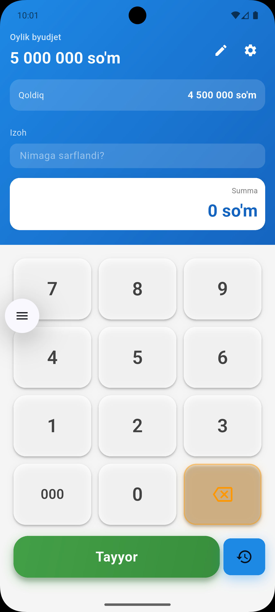
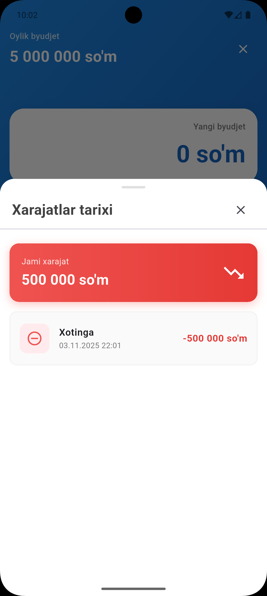

# Hisobla — Oylik Byudjetni Boshqarish Ilovasi

> **"Har bir so‘mni hisoblang — moliyaviy erkinlik sari yo‘l!"**

**Hisobla** — o‘zbek foydalanuvchilari uchun maxsus ishlab chiqilgan, oddiy va qulay **oylik byudjetni boshqarish** ilovasi. O‘z xarajatlarni nazorat qiling, byudjetni belgilang va moliyaviy intizomni saqlang!

---

## Foydalanuvchi Interfeysi (Screenshots)

| Asosiy ekran | Byudjet tahrirlash | Xarajat tarixi |
|--------------|---------------------|------------------|
|  |  |  |

---

## Xususiyatlar

- **Oylik byudjetni belgilash** — boshida o‘zingiz uchun limit qo‘ying  
- **Xarajatlarni qo‘shish** — har bir sarfni izoh bilan kiriting  
- **Qoldiqni real vaqtda ko‘rish** — qancha pul qoldi?  
- **Katta raqamlar uchun qulay formatlash** — `88 888 888 so‘m`  
- **Responsiv dizayn** — barcha ekran o‘lchamlariga mos  
- **Qorong‘i / Yorug‘ rejim** (kelajakda)  
- **Ma'lumotlar saqlanishi** — `SharedPreferences` orqali  
- **Flutter Bloc** — toza arxitektura  

---

## Texnologiyalar

```text
Flutter     - UI Framework
Dart        - Dasturlash tili
Flutter Bloc- State Management
SharedPreferences - Ma'lumot saqlash
